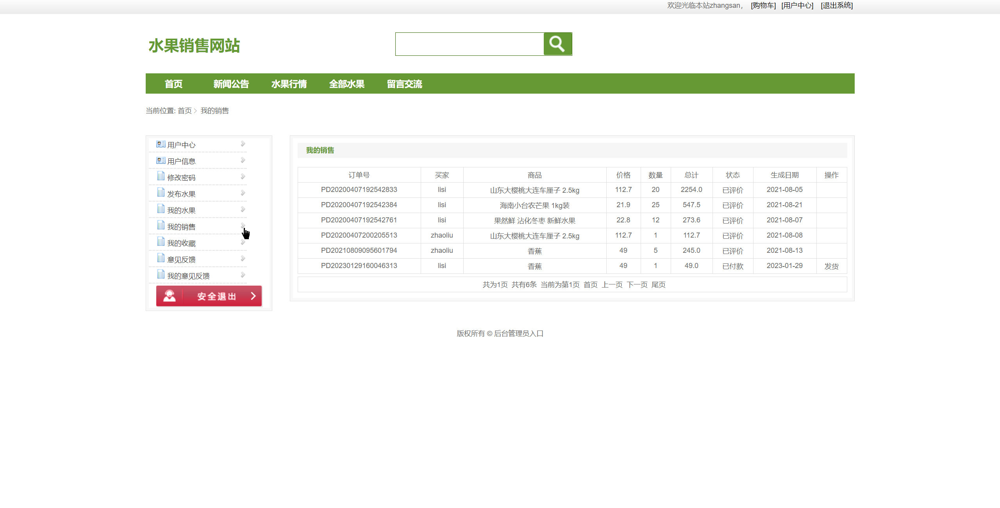

## 基于SSM框架的水果销售网站

###  获取sql数据库文件: 从戎源码网 (https://armycodes.com/) QQ: 386869957 QQ群: 377586148
###  所有系统地址: (https://github.com/YuLin-Coder/AllProjectCatalog) 
###  所有项目以及源代码本人均调试运行无问题 可支持远程安装部署调试、定制修改、代码讲解

## 项目介绍
基于SSM框架的水果销售网站，该系统主要分为前台和后台两大功能模块，共包含三个角色：农户、经销商和管理员。
具体的系统功能如下：
1.前台功能
前台首页、用户注册、用户登录、新闻公告、水果行情、查看水果、水果详情、加入购物车、加入收藏、购买水果、付款结算、添加评论、留言交流、个人中心、我的订单、我的收藏、意见反馈、发布水果、我的销售等功能。
2.后台功能
后台系统登陆、用户管理、管理员管理、网站内容管理、水果类型管理、水果信息管理、采购订单管理、用户评价管理、意见反馈管理、留言交流管理等功能。

## 项目技术
- 编程语言：Java
- 数据库：MySQL
- 前端技术：JSP、h-ui、Jquery、echart
- 后端技术：Spring、SpringMVC、MyBatis

## 运行环境
- JDK版本：JDK1.8及以上
- 开发工具：IDEA、Ecplise、Myecplise都可以
- 数据库: MySQL5.7及以上

## 运行截图

